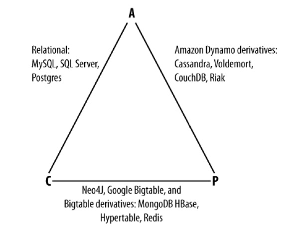

# Домашняя работа №1

## Цель: 
+ В результате выполнения ДЗ вы научитесь работать с гитом. 

## Задание: 
+ Необходимо написать к каким системам по CAP теореме относятся перечисленные БД и почему: MongoDB, MSSQL, Cassandra.
+ ДЗ сдается ссылкой на гит, где расположен миниотчет в маркдауне.

## CAP теорема 
+ C (consistency) — Согласованность. Каждое чтение даст вам самую последнюю запись.
+ A (availability) — Доступность. Каждый узел (не упавший) всегда успешно выполняет запросы (на чтение и запись).
+ P (partition tolerance) — Устойчивость к распределению. Даже если между узлами нет связи, они продолжают работать независимо друг от друга.
#### Доступные CAP комбинации:
В CAP говорится, что в распределенной системе возможно выбрать только 2 из 3-х свойств:
+ CA – система доступна и консистентна. Нежизнеспособна в ненадежной сети.
+ CP – не будет доступна пока нет полной синхронизации между всеми узлами.
+ AP – данные на разных работающих узлах могут отличаться
Многие статьи сводятся к вот такому вот простому треугольнику.

## MongoDB
#### Краткое описание базы данных
MongoDB — это документоориентированная NoSQL-база данных, которая хранит данные в формате гибких JSON-подобных документов (BSON). Основные особенности:

    Гибкая схема: Данные могут иметь разную структуру, что упрощает адаптацию к изменениям.

    Масштабируемость: Поддержка горизонтального масштабирования через шардирование.

    Высокая производительность: Оптимизирована для операций чтения/записи, поддерживает индексацию.

    Репликация: Обеспечивает отказоустойчивость через реплики.

    Язык запросов: Богатый API для запросов, агрегаций и работы с данными.

    Использование: Подходит для больших объемов данных, реального времени, IoT, мобильных приложений и аналитики.

MongoDB популярна благодаря своей гибкости, производительности и простоте интеграции.
#### По CAP теореме - CP/AP/A

+ Это ACID в ограниченном смысле на уровне документа.
+ В случае распределенной системы — it's all about that BASE.
+ В случае отсутствия разделений сети, система гарантирует, что чтение и запись будут согласованными.
+ Если Master узел упадёт или потеряет связь с остальной системой, некоторые данные не будут реплицированы. Система выберет нового мастера, чтобы оставаться доступной для чтения и записи. (Новый мастер и старый мастер несогласованы).
+ Система рассматривается как AP/A, так как большинство узлов остаются CAP-available в случае разрыва. Помните, что в CAP MongoDB обычно рассматривается как CP. Создателль PACELC, Даниэль Дж. Абади, говорит, что существует гораздо больше проблем с согласованностью, чем с доступностью, поэтому AP.

## MSSQL
#### Краткое описание базы данных
MSSQL (Microsoft SQL Server) — это реляционная система управления базами данных (СУБД), разработанная Microsoft. Основные особенности:

    Реляционная модель: Данные хранятся в таблицах с четкой структурой и связями.

    Язык запросов: Использует SQL (Structured Query Language) для работы с данными.

    Масштабируемость: Поддерживает как небольшие, так и крупные корпоративные приложения.

    Безопасность: Встроенные механизмы шифрования, аутентификации и авторизации.

    Интеграция с Microsoft: Тесно интегрирована с другими продуктами Microsoft (Windows Server, Azure, .NET).

    Аналитика и BI: Встроенные инструменты для анализа данных и бизнес-аналитики (SSIS, SSAS, SSRS).

    Высокая доступность: Поддержка репликации, кластеризации и резервного копирования.

MSSQL широко используется в корпоративных приложениях, веб-сервисах и системах, требующих надежности и сложной обработки данных.
#### По CAP теореме - CA
+ Строгая согласованность данных через механизмы транзакций (ACID-свойства).
+ Поддержка изоляции транзакций на разных уровнях (READ UNCOMMITTED, READ COMMITTED, REPEATABLE READ, SERIALIZABLE).
+ Использование двухфазного commit'a (2PC) для обеспечения согласованности в распределенных транзакциях.
+ Высокая доступность через репликацию (например, AlwaysOn Availability Groups) и кластеризацию (Failover Cluster Instances).
+ В случае сбоя одного узла система автоматически переключается на резервный узел, минимизируя downtime.
+ Поддерживает горячее резервирование и автоматическое восстановление.
+ MSSQL жертвует устойчивостью к разделению в пользу согласованности и доступности. В случае разделения сети система может стать недоступной для записи или чтения, чтобы сохранить согласованность данных.
+ В распределенных конфигурациях (например, AlwaysOn) при разделении сети MSSQL может остановить обработку запросов до восстановления соединения, чтобы избежать потери данных или их несогласованности.

## Cassandra
#### Краткое описание базы данных
Cassandra — это распределенная NoSQL-база данных, разработанная для обработки больших объемов данных с высокой производительностью и отказоустойчивостью. Основные особенности:

    Распределенная архитектура: Данные распределены across multiple nodes, что обеспечивает высокую доступность и масштабируемость.

    Линейная масштабируемость: Легко масштабируется добавлением новых узлов без downtime.

    Отказоустойчивость: Репликация данных across multiple nodes обеспечивает высокую надежность.

    Высокая производительность: Оптимизирована для операций записи и чтения, подходит для real-time приложений.

    Гибкая модель данных: Использует модель column-family (похожа на key-value), что позволяет хранить данные с разной структурой.

    Поддержка распределенных вычислений: Интеграция с Apache Spark и Hadoop для аналитики и обработки больших данных.

Cassandra широко используется в системах, требующих высокой производительности и отказоустойчивости, таких как IoT, социальные сети, рекомендательные системы и аналитика в реальном времени.
#### По CAP теореме - AP/A

+ Предназначена для «скоростного» взаимодействия (low-latency interactions).
+ ACID на уровне записи.
+ В случае распределенной системы — it's all about that BASE.
+ Если возникает разрыв связи, остальные узлы продолжают функционировать.
+ В случае нормального функционирования — система использует уровни согласованности для уменьшения задержки.
+ Система рассматривается как AP/A.

## Источники информации
+ https://habr.com/ru/articles/328792/
+ https://habr.com/ru/companies/alfa/articles/812417/
+ https://vk.com/@ylab_university-nosql-i-cap-teorema
+ [DeepSeek](https://chat.deepseek.com) для получения описания БД в определенном формате
